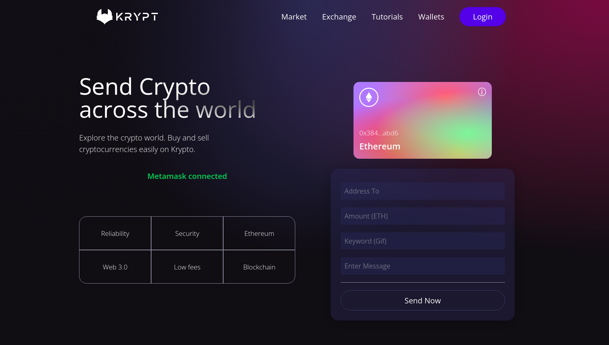
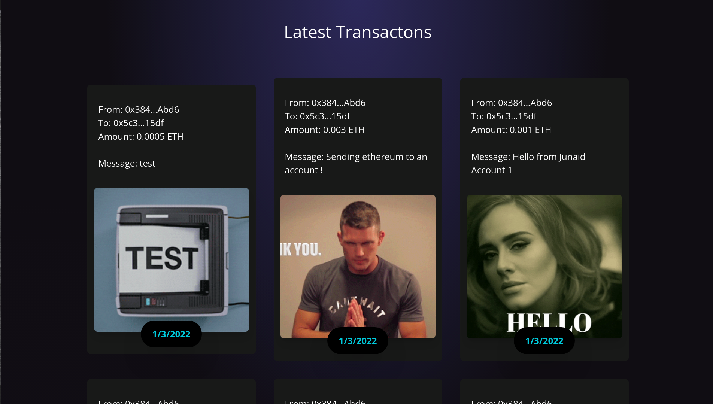
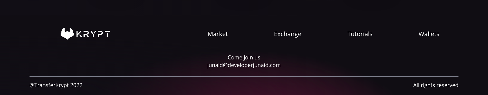
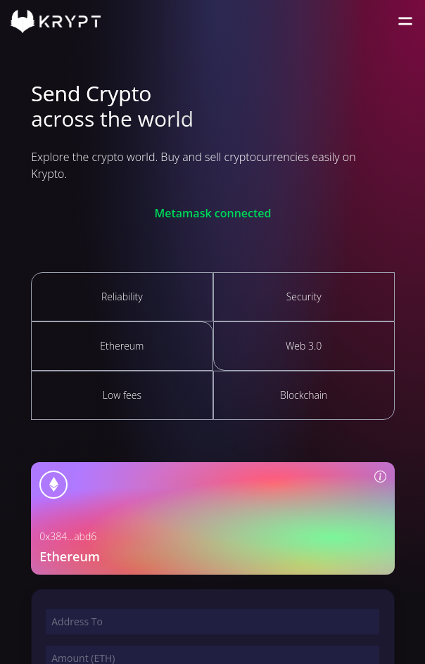
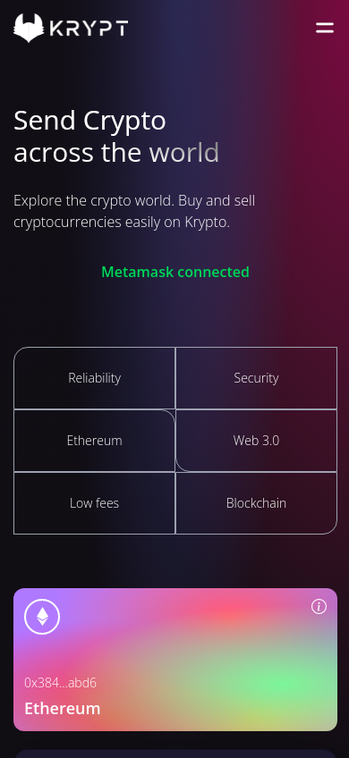
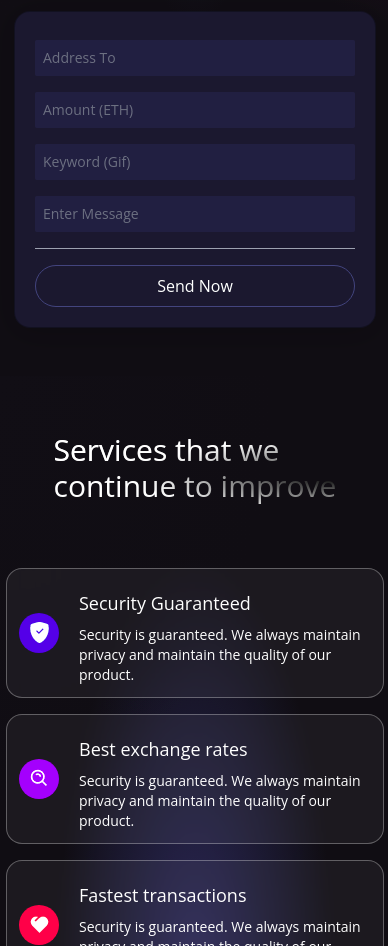

# :link: React Blockchain Web 3.0 App

### _React Blockchain Web 3.0 Website through that you can send ethereum to anyone using metamask account, developed using ReactJs, Solidity and Hardhat!!_

### :link: https://transferkrypt.netlify.app/

### Learned from : [JS-Mastery](https://youtu.be/Wn_Kb3MR_cU)

## Images

## Responsive

## Run Locally

- Run this command `git clone https://github.com/developer-junaid/Web3.0-Crypto-Website.git`
- You are now in the dev environment and you can play around

## Technologies

- ReactJs (Frontend)
- Solidity (To write smart contracts)
- Hardhat (To run solidity locally)
- Alchemy (To deploy smart contract on blockchain)
- Hardhat waffle (To build smart contract tests )
- Giphy (for gifs)
- Metamask Extension (To connect with the website)
